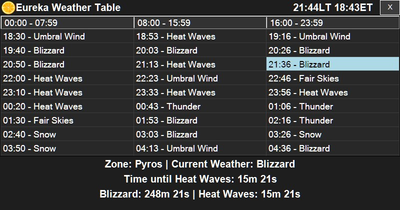

# Get-EurekaWeather
Display the weather in Eureka.

Shows the weather in Eureka (Final Fantasy XIV).
15 minutes and 10 minutes before notable weathers for the Zone you select, it will play ./assets/yoooooo.wav

How to use:
Download either the PS1 + the assets directory or the standalone executable.
Run the PS1 (colocated with the assets directory) or the executable.

