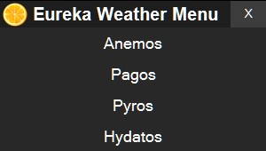

# Get-EurekaWeather
Display the weather in Eureka.

Shows the weather in Eureka (Final Fantasy XIV).
15 minutes and 10 minutes before notable weathers for the Zone you select, it will play ./assets/yoooooo.wav

